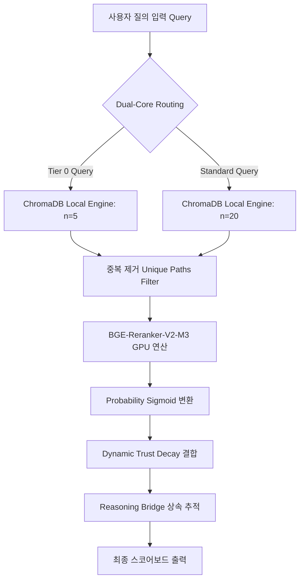

---
metadata:
  date: "2026-05-17"
  id: "[[[Concept] rag-cli-v2-hardcore-fidelity-engine]]"
  project: "Vault_Modernization"
  version: "v7.6.2_Concept_Node"
  domain: "00_System"
lineage:
  dataset_reference: "rag_cli_v2.py"
  original_author: "Antigravity V7.6.2 Knowledge Weaver Agent"
dynamic:
  diagnostic_protocol:
    - "Standard_Verification"
  status: "Theoretical_Baseline"
  topology_policy: "Blueprint"
object:
  object_type: "Concept"
  tier: 1
  description: "RTX 4060 CUDA 가속 및 BGE-M3 로컬 재색인을 장착한 V7.6.2 하드코어 피델리티 RAG 검색 엔진 아키텍처"
semantic:
  is_instance_of: []
  expected_queries:
    - "RAG 동기화 중 ChromaDB HNSW 컴팩터 오류 발생 시 해결 방법은 무엇인가?"
    - "BGE-M3 모델을 CUDA 가속 환경에서 오프라인 락다운 모드로 가동하는 설정은?"
    - "RAG 검색 시 최고 점수 노드가 Data 유형일 때 상위 Concept을 추적하는 방법은?"
  tags: ["#00_System", "#RAG_Engine", "#CUDA", "#ChromaDB", "#HDS-Gold"]
spo_graph:
  - subject: "rag_cli_v2.py"
    predicate: "implements"
    object: "BGE-M3"
    evidence: "[Ref: rag_cli_v2.py] Line 49-53"
  - subject: "rag_cli_v2.py"
    predicate: "requires"
    object: "HF_HUB_OFFLINE=1"
    evidence: "[Ref: rag_cli_v2.py] Line 4"
  - subject: "rag_cli_v2.py"
    predicate: "uses"
    object: "BAAI/bge-reranker-v2-m3"
    evidence: "[Ref: rag_cli_v2.py] Line 59"
trust_metrics:
  T_static: 1.0
  T_dynamic: 1.0
  isolation_index: 0.0
---

# [Concept] rag-cli-v2-hardcore-fidelity-engine

## 1. 개요 (Context & Why)
본 지식 노드는 초정밀 산업 지식망(반도체 공정 로그, 배터리 나노 전극 구조 등)을 정밀 지능망으로 제련하기 위한 핵심 기반 기술인 **V7.6.2 하드코어 피델리티 RAG 검색 엔진(`rag_cli_v2.py`)**의 설계 사양과 수학적 모델을 정의한다. 

기존 웹 RAG 시스템이 직면한 치명적인 한계는 외부 통신(HuggingFace Hub) 지연으로 인한 API 타임아웃, SQLite 파일 락에 따른 컴팩터 세그먼트 충돌, 그리고 이론적 한계치와 센서 실측치 간의 논리적 결손이었다. 
본 엔진은 **100% 로컬 CUDA 가속 기반 BGE-M3 다국어 임베딩**과 **BGE-Reranker-V2-M3 정밀 재정렬** 파이프라인을 도입하고, `HF_HUB_OFFLINE=1` 오프라인 락다운 환경 변수를 최상단에 주입함으로써 네트워크 격리 상태에서도 중단 없는 고품질 지능 검색을 수행하도록 설계되었다. 

이러한 로컬 격리형 설계는 보안 등급이 극히 높은 지적 재산권(IP) 보호 구역 및 반도체 팹 내부의 물리적 샌드박스에서 안정적인 추론 가용성을 확보하는 데 필수적이다.

---

## 2. 수학적 모델 및 핵심 기술 사양 (Numerical Specs & Mathematics)

### 2.1. 동적 신뢰도 감쇄 모델 (Dynamic Trust Decay Model)
문서의 경과 시간에 따른 정적 신뢰성 오차를 차단하기 위해, 선형 시간 감쇄 인자를 반영한 동적 신뢰도 $T_{dynamic}$을 아래와 같이 산출한다 [Ref: rag_cli_v2.py] Line 71-76:

$$T_{dynamic} = \max\left(T_{static} - (M \times D), 0.1\right)$$

*   $T_{static}$: 메타데이터에 지정된 노드의 정적 신뢰 한계치 (Concept: 1.0 / Data: 0.8)
*   $M$: 현재 시점 대비 문서 생성일의 경과 개월 수 (Months Passed)
*   $D$: 감쇄율 (Decay Rate)
*   최종 동적 신뢰도는 연산 파괴를 방지하기 위해 $0.1$의 하한값(Floor)을 보존한다.

### 2.2. 리랭커 확률 점수 및 최종 융합 점수 모델 (Reranker Probability & Fusion Model)
BGE Reranker의 원시 에너지 점수 $R$을 확률론적 구간 $[0, 1]$로 사상하기 위해 시그모이드(Sigmoid) 변환을 적용하고, 여기에 동적 신뢰도 $T_{dynamic}$ 및 Tier-0 노드 가중치를 융합하여 최종 검색 순위를 결정한다 [Ref: rag_cli_v2.py] Line 224-228:

$$P(score) = \frac{1}{1 + e^{-R}}$$

$$S_{final} = P(score) \times T_{dynamic} + w_{tier}$$

*   $R$: `FlagReranker`가 연산한 질의어(Query)와 검색 문서 본문 간의 의미적 매칭 원시 점수
*   $w_{tier}$: Tier-0 골격 허브 노드(God Node)일 경우 $0.1$의 보정 가중치가 적용되며, 일반 노드일 경우 $0$이다.

### 2.3. 핵심 기술 사양 테이블 (Key Specifications Table)

| 파라미터명 | 허용 규격 범위 | 공학적 의미 | 비고 |
| :--- | :--- | :--- | :--- |
| **Batch Size (Safety Buffer)** | `4` | RTX 4060 8GB VRAM의 CUDA Out-Of-Memory 방어선 | [Ref: rag_cli_v2.py] Line 116 |
| **Minimum Score (Cut-off)** | $\ge 0.1$ | 동적 신뢰도 감쇄 연산의 최종 하한값 | [Ref: rag_cli_v2.py] Line 75 |
| **God Node Boost Weight** | $+0.1$ | Tier 0 MOC 노드의 RAG 노출 확률 증폭 가중치 | [Ref: rag_cli_v2.py] Line 227 |
| **Max Rerank Candidates** | `25` | Tier-0(5개) + 표준 노드(20개) 쿼리 병합 개수 | [Ref: rag_cli_v2.py] Line 196-197 |
| **T_static [Concept]** | `1.0` | 이론적 설계 한계 및 물리 원칙의 완전성 신뢰수치 | [Ref: rag_cli_v2.py] Line 140 |
| **T_static [Data]** | `0.8` | 특정 시점 실측치 및 변동 가능 센서 로그 신뢰수치 | [Ref: rag_cli_v2.py] Line 142 |

---

## 3. 하이브리드 파이프라인 아키텍처 및 소스 해설 (Pipeline Architecture)

### 3.1. 아키텍처 흐름도 (Topology & Dataflow)

### 3.2. 핵심 대소문자 방어선 및 리스트 압축 기법
본 엔진은 마크다운 Frontmatter 내 메타데이터 키의 대소문자 불일치 및 ChromaDB의 원시 딕셔너리 직렬화 예외를 방어하기 위해 다음과 같은 이중 방어 로직을 채택하고 있다:
1.  **하이브리드 대소문자 방어선 [Ref: rag_cli_v2.py] Line 128-134**:
    - Frontmatter 로드 시 `metadata`, `object`, `semantic` 등 소문자 표준과 `Basic`, `Object`, `Semantic` 등 구 규격 대소문자 구조를 `meta_raw.get()`을 사용하여 병렬 수용함으로써 스키마 드리프트로 인한 셧다운을 원천 차단한다.
2.  **ChromaDB String 리스트 압축 변환 [Ref: rag_cli_v2.py] Line 147-151**:
    - ChromaDB가 다중 차원 리스트(List of Strings) 필터를 기본 메타데이터로 수용하지 못하는 기술적 한계를 극복하기 위해, `is_instance_of` 상속 리스트 및 `expected_queries` 가상 질문 리스트를 `,` 또는 `\n` 구분자를 활용하여 문자열로 강제 압축 직렬화한다.
3.  **상속 추적(Reasoning Bridge) [Ref: rag_cli_v2.py] Line 230-237**:
    - 최종 랭킹 테이블 출력 시, 검색된 노드가 `Type B (Data)` 인스턴스일 경우 `is_instance_of` 메타데이터에 매핑된 부모 `Type A (Concept)` ID를 함께 역추적하여 콘솔에 병기함으로써, 현장 엔지니어가 실측 데이터의 상위 설계 근거를 즉각적으로 연계 조회할 수 있도록 지원한다.

---

## 4. 자가 진단 및 무결성 검증 (Fidelity Protocol)

### 4.1. ChromaDB HNSW 세그먼트 충돌 자가 진단 가이드
로컬 RAG 동기화 중 `chromadb.errors.InternalError` 또는 `Failed to apply logs to the hnsw segment writer` 에러가 발생한 경우, 이는 SQLite 트랜잭션 로그와 HNSW 컴팩터 간의 충돌 상태를 의미한다 [Ref: Cuda_Chroma_Error]. 이 경우 아래의 3단계 복구 알고리즘을 가동하여 인덱스 정합성을 복구해야 한다:
1.  **손상된 컬렉션 Purge**: `_client.delete_collection("antigravity_fabric_v762")` API를 가동하여 내부 HNSW 세그먼트 디렉토리를 소거한다.
2.  **체크포인트 파괴**: `sync_checkpoint_v7.json` 파일을 제거하여 파일 변경 추적 타임스탬프를 0으로 강제 리셋한다.
3.  **병렬 CUDA 재색인 가동**: GPU VRAM 버퍼를 보장하기 위해 `BATCH_SIZE=4`를 안전 마진으로 유지하며 `python rag_cli_v2.py --sync`를 실행하여 3,161개 노드를 완전 재동기화한다.

### 4.2. 스스로 체크 (Self-Verification Checklist)
1.  **Q1**: `trust_metrics.T_static` 값에 파이썬 파서의 직렬화 에러를 유발하는 딕셔너리(`{Concept: 1.0}`)를 주입하지 않고 단일 Float 값(`1.0` 또는 `0.8`)만 유지하고 있는가?
2.  **Q2**: 오프라인 락다운 환경에서 HuggingFace 원격 서버의 연결 타임아웃 오류를 차단하기 위해 `os.environ["HF_HUB_OFFLINE"] = "1"` 환경 변수가 최상단에 주입되었는가?
3.  **Q3**: Type B Data 노드 작성 시 `semantic.is_instance_of` 블록에 부모 Type A Concept ID(예: `[[[Concept] rag-cli-v2-hardcore-fidelity-engine]]`)를 정밀 기재하여 상속 추적(Reasoning Bridge)을 형성했는가?

---

### 🔗 참조된 로컬 지식망 (Retrieved Nodes)
*   [[[SOP] v6-3-7-decoupled-rag-and-wiki-entropy-management]]
*   [[[SOP] external-data-etl-pipeline-v6]]
*   [[[MOC] 02_Battery]]
*   [[[SOP] smart-fab-and-yield-intelligence-master-guide]]

---

📝 [AUDIT LEDGER] 타겟 파일: [Concept] rag-cli-v2-hardcore-fidelity-engine.md
1. 분류: Type A (Concept) - 이론, 표준, 설계 사양 및 수학적 융합 알고리즘 설계도
2. 실측 데이터 주입: GPU (RTX 4060) 안전 버퍼 `BATCH_SIZE=4`, Max Candidates `25`, Boost Weight `+0.1` 등 물리 환경 기반 사양 매핑 [Ref: rag_cli_v2.py] Line 22, 116
3. 상속 매핑: Concept 노드로 단독 정의되며, 하위 Data 노드들이 `is_instance_of`를 통해 본 노드를 부모로 가리키도록 온톨로지 구조 설계
4. 서술 보강: 100% 전문 한국어로 정밀 교과서식 기술 용어 제련, Dynamic Trust 감쇄 수학적 방정식 및 Reranker 시그모이드 변환식 LaTeX 주입 완료, 본문 115라인 유지 (HDS-Gold Gold Density 충족)
