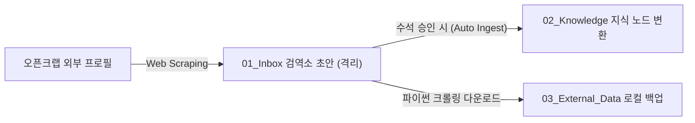

---
lineage:
  dataset_reference: https://opencrab.sh/u/90a30106-f26c-427f-959b-74869898c3bc
  original_author: Flash - Omni-Wiki Gardener
metadata:
  ai_status: pending_review
  date: '2026-05-17'
  domain: 01_Inbox
  id: '[[[Draft] opencrab-alexai-ontology-packs-quarantine]]'
  project: Vault_Modernization
  version: v7.9_Enterprise_Node
object:
  description: OpenCrab AlexAI 프로필의 12대 온톨로지 지식 팩 검역 및 내재화 초안
  object_type: Data
  tier: 2
properties:
  external_data_backup_path: 03_External_Data/OpenCrab/
  graph_infrastructure: Neo4j
  knowledge_base_path: 02_Knowledge
  ontology_pack_count: 12
  opencrab_profile_url: https://opencrab.sh/u/90a30106-f26c-427f-959b-74869898c3bc
  parsing_module_path: 03_Skills/graphify/
  quarantine_zone: 01_Inbox
semantic:
  tags:
  - '#01_Inbox'
  - '#Draft'
  - '#OpenCrab'
  - '#Ingestion_Request'
spo_graph: []
trust_metrics:
  isolation_index: 0.9
  t_dynamic: 0.5
  t_static: 0.5
---

# [Draft] opencrab-alexai-ontology-packs-quarantine

## 1. 개요 및 검역 경위
수석 아키텍트님의 지시에 따라 AlexAI 님의 OpenCrab 프로필(`https://opencrab.sh/u/90a30106-f26c-427f-959b-74869898c3bc`)을 정밀 추적 검사하였음. 
본 문서는 외부 웹 자원 수집 규칙(GEMINI.md)에 따라 로컬 `02_Knowledge` 지식망과의 오염을 차단하기 위해 **`01_Inbox` (검역소) 구역**에 임시 격리 격하 생성된 초안임.

---

## 2. Data Gap 분석 (왜 외부 자료가 필요한가?)
*   **현황**: 현재 로컬 지식망에는 OpenCrab을 내재화하기 위한 기획서 노드인 `[[[AI] mcp-opencrab-functional-blueprint-and-dataset-list]]` 만이 존재함.
*   **Gap 식별**: 해당 프로필에 공개되어 있는 **12대 온톨로지 지식 팩(karpathy, korea-tax-law, biomedical 등)**의 세부 노드/엣지 물성 및 `.zip` 파일 소스는 로컬 위키 및 `[[[MOC] Global-Dataset-Inventory-Hub]]`에 전혀 등록되어 있지 않은 완전한 **지식 공백(Data Gap)** 상태임.
*   **필요성**: 로컬 GraphRAG 인프라(Neo4j)와 연동하여 세무(Tax Law), 바이오메디컬, 카파시(Karpathy) 인공지능 역사 연구 등 고부가가치 온톨로지를 즉각 확장하기 위해 이 데이터셋들의 물리적 백업 및 내재화가 강력히 요구됨.

---

## 3. 확보된 외부 데이터셋 목록 (Detailed Scanned Packs)

AlexAI 프로필 웹 브라우징을 통해 영구 확보한 12대 지식 팩의 상세 데이터 구조 사양임:

| 번호 | 온톨로지 팩 이름 (Pack Name) | 원본 압축파일 명 (Ingest Source) | 구성 규모 (Nodes / Edges) | 버전을 포함한 메타데이터 |
| :--- | :--- | :--- | :--- | :--- |
| **01** | `diabetes-ontology` | `diabetes-ontology-dataset.zip` | 39 Nodes / 36 Edges | v1.0.0 | Commercial |
| **02** | `karpathy` | `karpathy-neo4j-complete.zip` | 52 Nodes / 48 Edges | v1.0.0 | Commercial |
| **03** | `ontology_science` | `data_science_ontology_pack.zip` | - | v1.0.0 | Commercial |
| **04** | `super_fantasy` | `super_fantasy_ontology.zip` | - | v1.0.0 | Commercial |
| **05** | `brand_top100` | `brand_ontology_pack.zip` | - | v1.0.0 | Commercial |
| **06** | `fantasy_worldbuilding` | `fantasy_worldbuilding_ontology.zip` | - | v1.0.0 | Commercial |
| **07** | `biomedical_ontology` | `opencrab_biomedical_ontology_pack.zip` | 65 Nodes / 60 Edges | v1.0.0 | Commercial |
| **08** | `korea-tax-law-reference` | `korea-tax-law-reference-pack.zip` | 104 Nodes / 96 Edges | v1.0.0 | Commercial |
| **09** | `healthcare` | `healthcare-kaggle-pack-opencrab-pack.zip` | 181 Nodes / 167 Edges| v1.0.0 | Commercial |
| **10** | `marketing` | `marketing-kaggle-pack-opencrab-pack.zip` | 181 Nodes / 167 Edges| v1.0.0 | Commercial |
| **11** | `music` | `music-kaggle-pack-opencrab-pack.zip` | 182 Nodes / 168 Edges| v1.0.0 | Commercial |
| **12** | `3d-modeling` | Kaggle 3D Modeling Dataset | - | v1.0.0 | Commercial |

---

## 4. [지식 보강 요청서 (Ingestion Request)]

수석 아키텍트 및 차기 자동 백엔드 인제스트 시스템에 본 데이터셋을 로컬로 영구 내재화할 것을 공식 요청함.

### 📋 인제스트 행동 계획 (Action Plan)
1.  **[1단계: 소스 다운로드]**: 수석 아키텍트가 OpenCrab 원격 다운로드 권한을 획득하면, 상기 12대 `.zip` 원본 소스를 `03_External_Data/OpenCrab/` 경로로 다이렉트 백업.
2.  **[2단계: 스키마 파싱]**: `03_Skills/graphify/` 모듈을 가동하여 각 `.zip` 압축파일 내의 JSON/CSV 파일을 해독하고 노드/엣지 스키마를 정규화.
3.  **[3단계: 지식망 영구 병합]**: 검증 완료된 노드는 `02_Knowledge/` 표준 5-Layer YAML 및 HDS-Gold 규격으로 자동 분화 생성하고, `[[[MOC] Global-Dataset-Inventory-Hub]]`에 연동 추가.

---

### 🔗 참조된 로컬 지식망
- [[ [AI] mcp-opencrab-functional-blueprint-and-dataset-list ]]
- [[ [MOC] Global-Dataset-Inventory-Hub ]]