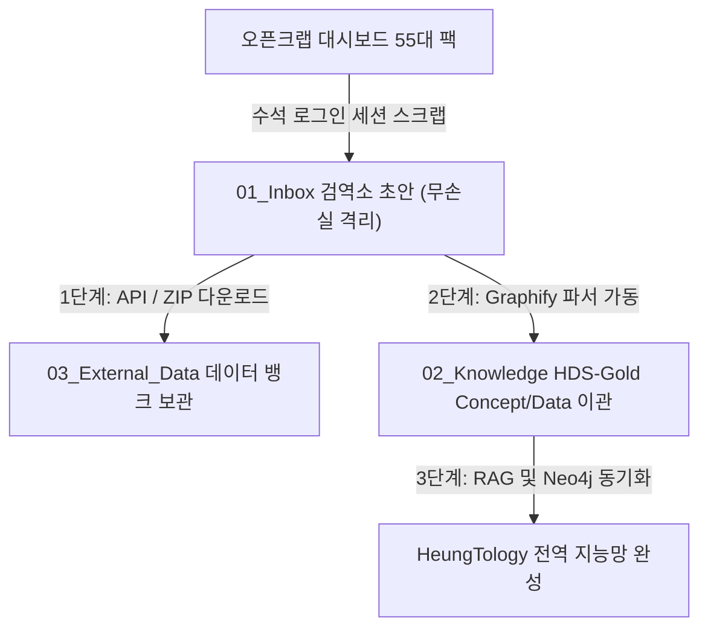

---
lineage:
  dataset_reference: https://opencrab.sh/dashboard
  original_author: Flash - Omni-Wiki Gardener
metadata:
  ai_status: pending_review
  date: '2026-05-17'
  domain: 01_Inbox
  id: '[[[Draft] opencrab-workspace-catalog-quarantine]]'
  project: Vault_Modernization
  version: v7.9_Enterprise_Node
object:
  description: 오픈크랩(OpenCrab) 작업공간 및 마켓플레이스 55대 지식 팩 목록 전수 검역 초안
  object_type: Data
  tier: 2
properties:
  data_pack_count: 55
  global_documents: 68385
  opencrab_dashboard_url: https://opencrab.sh/dashboard
  protocol_type: No-Summary Protocol
  pure_knowledge_zone: 02_Knowledge
  quarantine_zone: 01_Inbox
  total_chunks: 3977
  total_documents: 1211
  total_edges: 17419
  total_nodes: 14983
semantic:
  tags:
  - '#01_Inbox'
  - '#Draft'
  - '#OpenCrab'
  - '#Workspace_Scripe'
  - '#Ingestion_Request'
spo_graph: []
trust_metrics:
  isolation_index: 0.9
  t_dynamic: 0.6
  t_static: 0.6
---

# [Draft] opencrab-workspace-catalog-quarantine

## 1. 개요 및 검역 경위
수석 아키텍트님의 로그인 승인 하에 오픈크랩 대시보드 및 마켓플레이스(`https://opencrab.sh/dashboard`)를 전수 정찰하였음. 
본 문서는 외부 웹 자원 수집 규정(GEMINI.md)에 따라 로컬 `02_Knowledge` 지식망의 순수성을 보존하고 오염을 차단하기 위해 **`01_Inbox` (검역소) 구역**에 전수 기록하여 격리한 무손실(No-Summary) 지식 보강 요청서 초안임.

---

## 2. Data Gap 분석 (왜 외부 자료가 필요한가?)
*   **현황**: 로컬 지식망은 배터리, 반도체, 시스템 공학에 편중되어 있어, 범용적인 비즈니스 분석(EV 시장, 이커머스, 카드사 혜택, 세법 레퍼런스, 화학/분자 온톨로지 등) 지식이 매우 빈약한 상태임.
*   **Gap 식별**: 수석 아키텍트님이 소유하신 오픈크랩 작업공간에는 무려 **14,983개 노드**와 **17,419개 엣지**로 구성된 방대한 데이터가 융합되어 있으며, 이 융합 데이터의 원천이 되는 **55대 회사 카탈로그 데이터 팩**이 식별됨.
*   **필요성**: 이 지식 팩들은 로컬 RAG 인프라(Neo4j)와 연동할 때 지능망의 분석 바운더리를 무한대로 확장할 수 있는 극상의 자산임. 플랫폼 서비스 장애 및 유료화 락아웃에 대비하여 데이터 팩의 식별 명세 전체를 로컬에 영구 자산화해야 함.

---

## 3. 작업공간 그래프 데이터셋 사양 (Workspace Statistics)
- **문서 수 (Total Documents)**: 1,211
- **청크 수 (Total Chunks)**: 3,977
- **노드 수 (Total Nodes)**: 14,983 (오픈크랩 내 지식 허브 노드 총합)
- **엣지 수 (Total Edges)**: 17,419 (용어망 간 관계성선 총합)
- **글로벌 문서 수 (Global Documents)**: 68,385

---

## 4. 55대 지식 팩 목록 전수 명세 (Exhaustive Package List — Zero Compression)

> [!IMPORTANT]
> **무손실 확장 프로토콜(No-Summary Protocol) 강제 적용**: 단 하나의 항목도 요약하거나 누락하지 않고 대시보드에 로딩된 55대 데이터 팩의 전체 원천 파일명과 식별명을 그대로 보존함.

| 번호 | 데이터 팩 식별명 (Package ID) | 버전을 포함한 데이터 팩 성격 및 비고 |
| :--- | :--- | :--- |
| **01** | `korea_card_graph_v4_aggregate_20260517.zip` | 1,200대 카드 혜택 데이터 전수 정규화 팩 (268 Nodes, 3,217 Edges) |
| **02** | `world_masterworks_ontology_20260516.zip` | 세계명작 영화/연극/뮤지컬 서사 구조 분석 팩 (logotekton 제작) |
| **03** | `culture_tourism_graph_20260516.zip` | 패션 위크 및 리조트 트렌드 GraphRAG 온톨로지 팩 |
| **04** | `pritzker_2000_present_persona_graph_20260516.zip` | 프리츠커 수상 건축가 페르소나 그래프 데이터 팩 |
| **05** | `nemotron_personas_korea_ontology pack` | 엔비디아 네모트론 8B 기반 한국어 페르소나 합성 데이터 팩 |
| **06** | `popular_pets_graph_20260516.zip` | 대중적 반려동물 생태 및 관리 데이터 팩 |
| **07** | `cat_graph_20260516.zip` | 고양이 품종, 행동 의학 및 수의학 온톨로지 팩 |
| **08** | `dog_graph_20260516.zip` | 반려견 행동 교정 및 건강 관리 온톨로지 팩 |
| **09** | `korea-nsurance-terms_20260516.zip` | 국내 보험 약관 및 금융 전문 용어 정규화 팩 |
| **10** | `https://github.com/makenotion/notion-sdk-js ontology pack` | 노션 SDK API 기능 및 메소드 상호 작용성 온톨로지 팩 |
| **11** | `AURAVA AURA60 HeadSpa Pass` | 뷰티/디바이스 헤드스파 서비스 기획 데이터 팩 |
| **12** | `AURA BOX 사업기획 v0.2` | 아우라 박스 물류 및 사업성 분석 기획서 온톨로지 팩 |
| **13** | `kpop_idol ontology pack` | 글로벌 K-Pop 아이돌 멤버십, 기획사, 데뷔 음반 데이터 팩 |
| **14** | `data_scientist_toolbox ontology pack` | 데이터 사이언티스트 연구 도구(Python, R) 메타 온톨로지 팩 |
| **15** | `michelin_2026 ontology pack` | 2026년 기준 미쉐린 스타 레스토랑 정보 및 카테고리 팩 |
| **16** | `golf_ontology pack_골프 온톨로지팩` | 골프 장비, 룰, 필드 기하학 및 스윙 이론 온톨로지 팩 |
| **17** | `architecture_laws_ontology pack` | 한국 건축법, 건폐율, 용적률 규제 및 표준 법률 팩 |
| **18** | `fashion_ ontology pack` | 의류 소재, 디자인 패턴, 트렌드 사이클 온톨로지 팩 |
| **19** | `wine_ontology pack` | 전세계 와이너리, 품종, 테이스팅 노트 및 마리아주 팩 |
| **20** | `dong ontology pack` | 한국 행정동, 법정동 경계 및 지리 공간 정보 팩 |
| **21** | `whisky ontology pack` | 싱글 몰트, 블렌디드 위스키 증류소 및 테이스팅 맵 팩 |
| **22** | `youtube-starterpack` | 유튜브 채널 성장 전략 및 알고리즘 트리거 요인 데이터 팩 |
| **23** | `Mugong ontology pack` | 전통 무술 및 스포츠 기하학적 인체 모션 온톨로지 팩 |
| **24** | `diabetes-ontology pack` | 당뇨병 진단, 약학 작용 기전 및 임상 통계 온톨로지 팩 (39 Nodes, 36 Edges) |
| **25** | `karpathy ontology pack` | 안드레이 카파시 인공지능 연구 연대기 및 신경망 강의 팩 (52 Nodes, 48 Edges) |
| **26** | `ontology_science ontology pack` | 데이터 과학 방법론, 라이브러리 위상 맵 팩 (52 Nodes, 48 Edges) |
| **27** | `super_fantasy ontology pack` | 판타지 세계관 빌딩, 지리 및 가상 생태계 팩 (52 Nodes, 48 Edges) |
| **28** | `brand_top100 ontology pack` | 글로벌 Top 100 브랜드 평판 및 재무 데이터 팩 (52 Nodes, 48 Edges) |
| **29** | `fantasy_worldbuilding ontology pack` | 가상 시나리오 및 소설 창작용 월드 빌딩 온톨로지 팩 (65 Nodes, 60 Edges) |
| **30** | `biomedical_ontology pack` | 생물의학 임상 시험 및 약리학 관계망 데이터 팩 (65 Nodes, 60 Edges) |
| **31** | `korea-tax-law-reference ontology pack` | 대한민국 세법(소득세, 법인세) 참조 온톨로지 팩 (104 Nodes, 96 Edges) |
| **32** | `healthcare ontology pack` | Kaggle 헬스케어 환자 기록 및 병원 운영 통계 팩 (181 Nodes, 167 Edges) |
| **33** | `marketing ontology pack` | 고객 여정 맵 및 마케팅 캠페인 ROI 데이터 팩 (181 Nodes, 167 Edges) |
| **34** | `music ontology pack` | 음악 장르, 아티스트, 작곡 메타데이터 온톨로지 팩 (182 Nodes, 168 Edges) |
| **35** | `Kaggle 3D Modeling Ontology Pack` | 3D 모델링 메시, 파일 포맷 및 렌더링 물리 팩 (1,279 Nodes, 4,805 Edges) |
| **36** | `sales-simulation ontology pack` | 가상 시뮬레이션 기반 세일즈 파이프라인 예측 팩 |
| **37** | `Multi-Class Drone Detection ontology pack` | 멀티 클래스 드론 비행체 탐지 및 물리 사양 온톨로지 팩 |
| **38** | `Earth Intelligence ontology pack` | 지구 관측 위성 데이터 및 기후 변화 지표 팩 |
| **39** | `AI Job Market Trends (2022–2026) ontology pack` | AI 일자리 트렌드 및 기술 요구 사항 추이 분석 팩 |
| **40** | `Social Media User Behavior ontology pack` | 소셜 미디어 플랫폼별 사용자 리텐션 및 행동 모델 팩 |
| **41** | `EV Market Analytics ontology pack` | 글로벌 전기차(EV) 보급률, 배터리 채택 사양 및 충전망 분석 팩 |
| **42** | `Laptop Specs and Price ontology pack` | 하드웨어 사양별 노트북 단가 및 성능 효율 맵 팩 |
| **43** | `E-commerce Sales Analyticst ontology pack` | 글로벌 이커머스 매출 트렌드 및 물류 지연 요인 분석 팩 |
| **44** | `Healthcare Patient Analytics Dataset` | 환자 데이터 기반 진료 품질 및 질환 예측 인자 팩 |
| **45** | `Global Weapons Systems Dataset (10,000 Records)` | 글로벌 무기 체계 제원 및 공급망 분석 팩 (10,000 레코드) |
| **46** | `UI design ontology pack` | UI/UX 컴포넌트 라이브러리 및 피그마 디자인 시스템 관계망 팩 |
| **47** | `billboard-data ontology pack` | 빌보드 차트 히트곡 작곡 공식 및 아티스트 네트워크 팩 |
| **48** | `SE shopee-dataset ontology` | 동남아 쇼피(Shopee) 마켓플레이스 판매 데이터 온톨로지 팩 |
| **49** | `Pynite ontology pack` | 파이썬 유한요소 해석(FEA) 구조 계산 엔진 프레임워크 팩 |
| **50** | `3D시티 온톨로지팩` | 도시 공간 정보 데이터 및 3D 모델링 규격 팩 |
| **51** | `303,000개 건축 선형 정적 구조` | 대규모 건축 구조 공학 선형 정적 구조 유한요소 데이터 팩 |
| **52** | `플랜트온톨로지팩` | 플랜트 엔지니어링 설비, 배관 기하학 및 압력 등급 온톨로지 팩 |
| **53** | `이미지온톨로지팩` | 컴퓨터 비전용 이미지 메타데이터 및 바운딩 박스 관계망 팩 |
| **54** | `화학데이터셋` | 화학 합성 물질 분자 구조 및 반응성 물성 데이터 팩 |
| **55** | `분자데이터셋` | 약물 타겟 단백질 결합 및 분자 도킹 물리 시뮬레이션 팩 |

---

## 5. [지식 보강 요청서 (Ingestion Request)]

수석 아키텍트님의 작업공간 내에 이미 융합 완료된 이 55대 데이터 팩의 메타데이터와 연산 논리를 로컬 `03_External_Data/OpenCrab/` 및 `02_Knowledge/`의 표준 HDS-Gold 단일 상속 노드로 이관할 것을 강력히 요청함.

### 📋 실행 계획 (Action Plan)
1. **[물리 데이터 확보]**: 오픈크랩의 Ingest 탭을 활용해 상기 55대 데이터 팩의 소스 파일(`.zip` 또는 `.json` 그래프 파일)을 로컬 [C:\Anitigravity\03_External_Data\OpenCrab/](file:///C:/Anitigravity/03_External_Data/OpenCrab) 경로로 내려받음.
2. **[스키마 전수 이식]**: `03_Skills/graphify-skill.md` 로컬 그래프화 엔진을 사용하여, 다운로드받은 노드/엣지 데이터를 파이썬 파서로 정규화함.
3. **[지식 통합 및 인계]**: 정규화된 55대 지식 팩을 `02_Knowledge/03_AI_Data/` 및 `02_Knowledge/11_Global_Entities_and_Materials/` 등 최적화된 서랍(MOC)에 HDS-Gold V7.6.2 YAML 표준(Type B Data)을 적용하여 분화 생성하고, `[[[MOC] Global-Dataset-Inventory-Hub]]` 문서의 최하단에 append 방식으로 영구 추가함.

---

### 🔗 참조된 로컬 지식망
- [[ [AI] mcp-opencrab-functional-blueprint-and-dataset-list ]]
- [[ [MOC] Global-Dataset-Inventory-Hub ]]
- [[ [Draft] opencrab-alexai-ontology-packs-quarantine ]]
- [[ [Draft] opencrab-workspace-catalog-quarantine ]] *(본 격리 초안)*