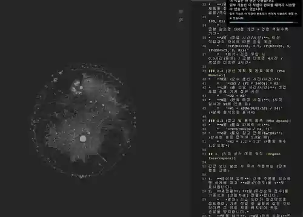
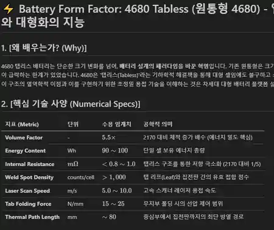

# HeungTology

제조·반도체·배터리 분야의 Markdown 지식을 **관계형 Graph와 RAG 검색으로 연결**하고, 검색된 근거를 바탕으로 **Gemma 12B Agent가 검토용 엔지니어링 문서 초안**을 작성하는 개인 제조 AX 프로토타입입니다.

```text
Markdown·YAML 원문
→ Graphfy 관계 연결
→ 변경 파일 감지
→ BGE-M3 Embedding·ChromaDB 증분 Upsert
→ 후보 검색·BGE Reranking
→ Gemma 12B 문서 초안
→ 엔지니어 원문·수치·적용범위 검토
```

## 해결하려는 문제

제조 현장의 공정·설비·품질 지식은 파일마다 용어, 폴더, 링크와 작성 형식이 달라 같은 문제가 재발해도 과거 원문과 관련 문서를 다시 찾는 데 시간이 듭니다. 검색 결과를 찾은 뒤에도 원인분석 보고서, 공정 Spec과 실행계획으로 재구성하려면 별도의 정리 작업이 필요합니다.

HeungTology는 기존 Markdown 원장을 유지하면서 다음 흐름을 연결합니다.

- YAML Frontmatter와 문서 링크를 이용한 지식 구조화
- Graphfy를 이용한 분산 문서의 관계 시각화
- 신규·수정 파일만 반영하는 증분 RAG 색인
- 자연어 질문에 대한 후보 원문 검색·재정렬
- 검색된 지식노드를 사용한 Gemma 12B 엔지니어링 초안 생성
- 원문 근거·수치·공정조건을 사람이 다시 확인하는 검토 Gate

## 1. Knowledge Graph: 분산 문서에서 관계형 지식으로

### 분산된 지식 상태


문서와 Metadata는 존재하지만 도메인·상위개념·관련문서의 연결이 약한 상태입니다.

### Graphfy 연결 후



문서 링크, Frontmatter와 관계 Metadata를 바탕으로 지식노드 간 연결을 시각화했습니다. Graph View는 검색결과의 원문·상위관계·연관문서를 탐색하는 보조계층입니다.

## 2. RAG Retrieval Core

공개 코드의 검색 코어는 다음 순서로 동작합니다.

### Knowledge Source

지식 원문은 `02_Knowledge` 아래 Markdown 파일로 관리합니다. YAML Frontmatter에서 Domain, Object Type, Tier, `is_instance_of`, Expected Queries, SPO 관계, 문서일자와 신뢰도 값을 읽습니다.

### Incremental Sync

`rag_cli_v2.py --sync` 실행 시 다음 순서로 동작합니다.

1. 대상 폴더의 Markdown 파일 탐색
2. 제외 폴더 필터링
3. 파일 수정시각과 Checkpoint 비교
4. 신규·수정 파일만 Parsing
5. ChromaDB 문서 단위 Upsert
6. 동기화 Checkpoint 갱신

### Retrieval and Reranking

1. BGE-M3 Query Embedding
2. Tier 0 후보와 일반 후보 검색
3. 동일 파일경로 중복 제거
4. BGE Reranker 기반 Query–Document 재정렬
5. 문서일자·Trust Score 반영
6. 본문 SHA-256과 Evidence Hash 비교
7. 후보 파일명·상위관계·Score·무결성 상태 출력

## 3. Gemma 12B Agent 문서생성

RAG 검색 결과와 관계형 지식노드를 Gemma 12B Agent의 Context로 전달해 Markdown 형식의 엔지니어링 초안을 생성했습니다.



```text
사용자 요청
→ Graph·RAG 후보검색
→ 관련 지식노드·원문 Context
→ Gemma 12B Agent
→ 원인분석·Spec·FMEA·실행계획 Markdown
→ 엔지니어 검토·수정
```

### 공개 실행 예시

- [LFP 전극 탈리·밀도 부족 원인분석 초안](examples/agent_outputs/REPORT_LFP_ELECTRODE_ADHESION_DENSITY_ANALYSIS_GEMMA12B_DRAFT.md)
- [SIB 50Ah 제조공정 Spec 초안](examples/agent_outputs/SIB_50Ah_CELL_MANUFACTURING_PROCESS_SPEC_GEMMA12B_DRAFT.md)
- [SIB 50Ah Cell 설계 Spec 초안](examples/agent_outputs/SIB_50Ah_CELL_DESIGN_SPECIFICATION_GEMMA12B_DRAFT.md)
- [Agent Output Sample 설명](examples/agent_outputs/README.md)

위 산출물은 로컬 지식망과 Gemma 12B 실행에서 생성된 **검토용 문서 초안**입니다. 실제 공정·제품 적용 전에는 출처, 수치, 조건, 적용범위와 보안등급을 엔지니어가 다시 판정합니다.

## 현재 구성과 증거

| 계층 | 현재 상태 | 공개 증거 |
|---|---|---|
| Markdown·YAML 지식원장 | 구현 | `02_Knowledge` |
| 관계 Graph | 로컬 실행 | Graphfy 전·후 Screenshot |
| 증분 RAG 검색 | 구현 | `rag_cli_v2.py` |
| ChromaDB·BGE-M3·Reranker | 구현 | 공개 검색코드 |
| Gemma 12B 문서생성 | 로컬 실행 | Screenshot·Markdown Sample 3건 |
| Web·권한·감사로그 | 후속 | Engineering Gate |

## 실행

### 환경

현재 공개 검색코드는 Windows 로컬 CUDA 환경을 사용합니다.

- Python
- CUDA 대응 PyTorch
- ChromaDB
- Sentence Transformers
- FlagEmbedding
- python-frontmatter
- BGE-M3·BGE Reranker Model

### 전체 또는 변경분 동기화

```powershell
python rag_cli_v2.py --sync
```

### 자연어 검색

```powershell
python rag_cli_v2.py "2170 저항용접 미접합과 Formation IR의 관계"
```

## 전통 제조기업 적용 관점

이 프로젝트의 핵심은 기존 문서를 대규모 시스템으로 이관하기 전에 작은 범위에서 다음 선순환을 만드는 것입니다.

```text
문서 표준화
→ 검색 가능성 향상
→ 관련 원문 재사용
→ Agent 문서초안 생성
→ 엔지니어 검토
→ 수정된 지식 재색인
```

- 기존 Markdown·문서 폴더 재사용
- 변경분 중심의 증분 색인
- Graph 관계와 원문 후보를 함께 탐색
- 반복 보고서·Spec 초안 작성 지원
- 잘 검색되지 않는 문서의 Metadata·용어 개선

## 다음 Engineering Gate

- 삭제·이동 파일과 Index 정합화
- 문서 Chunking·원문 위치 Anchor
- 대표 Query·정답문서 Ground Truth 기반 Retrieval 평가
- Graphfy 관계 생성·갱신 절차의 코드화
- Gemma 12B Agent Prompt·Context·Output Version 고정
- 생성문서 Citation·원문 Readback
- CPU Fallback·External API Adapter
- Web UI·사용자 인증·부서별 권한
- Secret·감사로그·장애복구·운영배포
